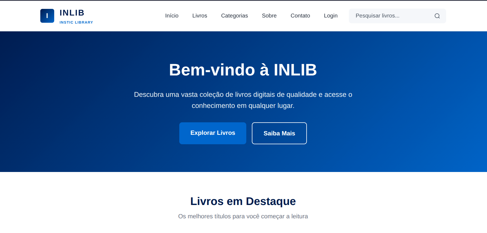

# INSTIC Library -INLIB

Sistema web minimalista de gestão de biblioteca desenvolvido para o Instituto Superior de Tecnologias de Informação e Comunicação (INSTIC).

O projeto foi construído com foco em simplicidade, organização e facilidade de evolução futura, seguindo boas práticas de arquitetura MVC.

<p align="center">
  
</p>

---

## Objetivo e Filosofia

O sistema foi desenhado para ser:
* Minimalista e Modular: Código limpo e separação clara de responsabilidades.
* Escalável: Estrutura preparada para futuras extensões e novas funcionalidades.
* Focado no Ambiente Académico: Simples de usar tanto para estudantes como para administradores.

---

## Funcionalidades Principais

### Área Pública
* Pesquisa Avançada: Consulta rápida do acervo e catálogo de livros.
* Leitura Integrada: Visualização e leitura de livros em formato PDF diretamente no navegador.
* Informações: Acesso facilitado aos detalhes do acervo disponível.

### Área Administrativa
* Painel de Controlo: Dashboard para visão geral do sistema.
* CRUD de Livros: Adicionar, editar e remover livros do catálogo.
* Gestão de Média: Upload e organização dos ficheiros PDF.
* Gestão de Utilizadores: Controlo de acessos à área administrativa.

---

## Tecnologias Utilizadas

* Backend: PHP 8.0+
* Template Engine: Twig
* Gestão de Rotas: Pecee Simple Router
* Gestão de Dependências: Composer
* Frontend: CSS3 e JavaScript (Vanilla)

---

## Estrutura do Projeto

```text
├── app/                      # Lógica da Aplicação (MVC)
│   ├── Controllers/          # Controladores (Public/ e Admin/)
│   ├── Models/               # Modelos de Dados
│   ├── Repositories/         # Camada de Persistência de Dados
│   └── Services/             # Regras de Negócio e Serviços Externos
├── public/                   # Diretório Raiz Web (Ponto de acesso público)
│   ├── index.php             # Front Controller
│   └── assets/               # Ficheiros compilados/públicos
├── resources/                # Ficheiros de Recursos do Frontend
│   ├── assets/               # Códigos fonte CSS/JS e Imagens
│   └── views/                # Templates Twig (public/ e admin/)
├── routes/                   # Definição de Rotas
│   ├── admin.php             # Rotas do painel administrativo
│   └── web.php               # Rotas da área pública
├── storage/                  # Ficheiros Locais e Uploads
│   └── books/pdf/            # Armazenamento seguro dos PDFs dos livros
└── vendor/                   # Dependências do Composer
```
## Sistema de Rotas e Arquitetura
O sistema utiliza o Pecee Simple Router para desacoplar as rotas da lógica dos controladores:

* routes/web.php manipula toda a experiência do utilizador final e leitor.
* routes/admin.php protege e gere as rotas restritas aos gestores da biblioteca.
* Os PDFs dos livros ficam guardados em storage/books/pdf/, garantindo que os ficheiros originais possam ser protegidos ou servidos de forma controlada pela aplicação.

## Instalação e Configuração
1. Clonar o Repositório
```bash
git clone <repo-url>
cd instic-library-system
composer install
```

## Configurar o Servidor Web (Virtual Host)
* O servidor web (Apache/Nginx) deve apontar para a pasta /public como raiz do documento (DocumentRoot), e não para a raiz do projeto.
* 127.0.0.1   inlib.local

## Instituição
[INSTIC – Instituto Superior de Tecnologias de Informação e Comunicação](https://instic.uniluanda.ao/)
